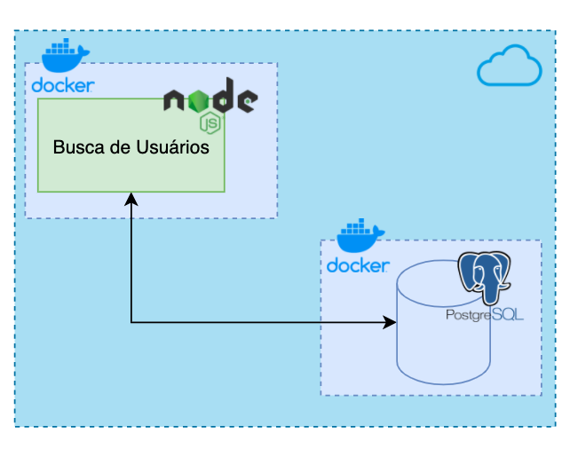

# PicPay Software Engineer Challenge


A solução expõe endpoints para buscar usuários por seu nome ou nome de usuário. 
Alguns usuários tem mais prioridade que outros, para definir quem são eles levamos em consideração duas "listas de relevancia" nas quais nos baseamos para ordenar o resultado da busca.

### ✅ Pré-requisitos

Antes de começar, você vai precisar ter instalado em sua máquina as seguintes ferramentas:
[Git](https://git-scm.com), [Node.js](https://nodejs.org/en/),[Docker](https://www.docker.com/),[GNU Make](https://www.gnu.org/software/make/). 
Além disto é bom ter um editor para trabalhar com o código como [VSCode](https://code.visualstudio.com/).

### 🛠 Tecnologias

As seguintes ferramentas foram usadas na construção do projeto:

- [Node.js](https://nodejs.org/en/)
- [Docker](https://www.docker.com/)
- [PostgreSQL](https://www.postgresql.org/)
- [TypeOrm](https://typeorm.io/#/)
- [TypeScript](https://www.typescriptlang.org/)

### 🎲 Rodando o Back End (servidor)

#### Arquitetura da solução



Na nossa solução o make é responsável por realizar uma sequência de comandos com o docker e o docker-compose. No Makefile rodamos o container do banco de dados, a importação dos dados e a nossa aplicação principal.

#### O que é o Make? 
O make é um utilitário que compila automaticamente programas e bibliotecas do arquivo fonte através da leitura de instruções contidas em arquivos denominados Makefiles, que descrevem as instruções de como obter o programa de destino.

Para nossa solução, são necessários os seguintes comandos: 

```
$ make up
```

O script (`make up`) inicia o container de banco de dados e logo após inicia o download dos "bancos de dados" de uma url externa. Quando finalizado o dowload os extrai na pasta /data, e inicia o processo de importação para o banco no nosso container. ( Esse processo demora de 3 a 5 minutos em média )
Assim que os dados são importados no nosso banco o container da aplicação é iniciado e estará disponível no endereço:
`
    http://localhost:3330
`

```
$ make down
```

O comando (`make down`) encerra os nossos containers.

### 📚 Documentação

Todos os endpoints estão documentados através do [Swagger](https://swagger.io) e estará disponível na url:
`
    http://localhost:3330/swagger
`
 
 ### Authors

<a href="https://github.com/puccinellirpr">
 
 <br />
 <sub><b>Reginaldo Puccinelli</b></sub></a> <a href="https://github.com/puccinellirpr" title="Rocket" > 🚀</a>

Feito com 💚 por Reginaldo Puccinelli

[](https://www.linkedin.com/in/reginaldopuccinelli/)
[](mailto:puccinellirpr@gmail.com)